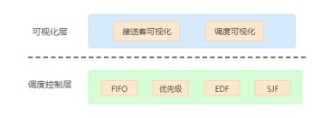

# TaxiSimulator

## 要求
1.通过仿真工具构建一个实时系统的例子（如机器人、自动驾驶等）

2.能够灵活的运用工具模拟计算模块、通信模块以及被研究对象

3.在例子中分析典型的几种调度算法（如FIFO、优先级、Round-Robin、EDF等）

## 场景描述
随着自动驾驶的快速发展，嘀嗒公司不仅推出了出租车服务，更是想效仿滴滴，准备推出多人拼车服务。目前在成熟的自动驾驶技术之上，需要对车辆的接客和送客任务进行合理的调度。为了保证拼车服务能为用户带来良好的用户体验，尽量减少用户的等待和出行时间，调度系统会根据接客所需时间、送客所需时间以及用户填写的最晚到达时间，决定任务执行的先后顺序，以帮助车辆更高效的进行运作。

拼车系统作为一个实时系统，客户从下单到被接到的时间和从接到到被送达目的地的时间决定了用户体验是否良好，合理的调度策略能够大大提高用户对系统的满意度。系统预设了FIFO、EDF、优先级和SJF四种调度策略，当车辆接到了多个订单需要前往不同地点接乘客时，或车上有多个乘客需要前往不同地点送客或接新客人时，系统会根据选定的调度策略进行调度。

# 场景实现说明

为便于展示和理解，此次作业仅模拟一辆车对多个订单的调度任务，假设所有订单在到达后，都进入一个队列中，车辆对订单的调度将根据具体的调度策略分别进行实现和展示。

考虑到送客和接客，本质上是两个相似的任务，在实现的过程中这两类调度将采用相同的调度策略。但是有如下**约束**：

（1）  接客任务的截止时间=用户填写的最晚到达时间-送客所需时间；

（2）  接客任务完成之后触发送客任务的到来；

（3）  送客任务的到达时间是接客任务的完成时间；

（4）  每个接客或送客任务对应一位乘客的上车或下车；

（5）  车上只能坐不超过4位乘客。

实际情况中，车辆接送乘客A可能导致乘客B的接客时间有所增加，需要在每个任务结束的时候重新计算每个任务的执行时间，然后根据调度策略选择接下来要执行的任务。为了便于理解，本次模拟就暂不考虑任务执行时间的变化。

对于车辆调度而言，如果使用Round-Robin算法进行调度是不现实的，因为如果在一个时间片内先往地点A，在下一个时间片执行另一个任务，调转方向往目的地B开，很可能最后既不能到达地点A也不能到达地点B。因此，在本次模拟中不考虑Round-Robin的调度策略，仅对FIFO、EDF、SJF、Priority-based四种调度策略进行模拟和分析。

# 系统设计

根据作业要求，计划使用Vue+SpringBoot实现一个模拟自动调度接客和送客任务的拼车系统作为实时系统的实例。系统具有以下特点：

- 可通过输入框指定5个接客任务的优先级，任务开始的时间和最晚到达时间，以及车辆接客需要的时间和送客需要的时间。

- 在一确定的时刻，车辆只能执行接客或送客任务中的一种。
- 该实例是简化的拼车调度系统，不考虑任务执行到一半，选出新的可执行任务的情况，因此所有调度都是非抢占式。
- 当遇到同时产生的任务时，由调度器决定任务执行的顺序。
- 调度的过程和结果可以通过动画和图表的形式展现。

根据系统特点，将系统分为可视化层和调度控制层，系统架构图如图1所示。可视化层基于Vue框架实现，调度控制层使用Java语言编写。各层的功能简述如下：

- 可视化层：在可视化层，用户通过填表形式初始化5个任务的到达时间、接客所需时间、送客所需时间、优先级和最晚到达时间。选择调度策略后，系统根据调度控制层返回的调度结果，以汽车图标的移动、人物图标的出现和消失、小旗图标的出现和消失，可视化车辆接客、送客的过程。同时，系统以折线图的形式可视化调度结果。
- 调度控制层：根据用户设定的任务属性和调度策略，调度器决定任务的执行顺序，并将调度结果以数组的形式返回给可视化层。

图1-系统架构图

 

# 二、 策略分析

## a)   FIFO

当队列中有多个任务要完成时，系统根据接客/送客任务到达时间的先后，前往不同地点接乘客或送乘客，到达时间早的任务会率先被处理。FIFO策略实现简单，但忽略了任务可能存在的紧迫性等。

## b)   EDF

当队列中有多个任务要完成时，系统将根据任务的deadline的先后，前往不同地点接乘客或送乘客，结束时间早的任务会率先被处理。其中，接客任务的deadline等于乘客设定的最晚到达时间减去送客所需时间，送客任务的deadline等于乘客设定的最晚到达时间。EDF策略在抢占式的情况下是最优的，但在非抢占式的情况下，可能导致一些任务被阻塞并最终使得lateness增加。

## c)   Priority-based Scheduling

当队列中有多个任务要完成时，系统将根据任务的优先级，前往不同地点接乘客或送乘客，优先级较高的任务会率先被处理。其中，送客任务的优先级与它对应的接客任务的优先级一致。Priortiby-based策略能够最大限度减少级别高的乘客的等待时间，但可能导致较低优先级的乘客一直在等待。

## d)   SJF

当队列中有多个任务要完成时，系统将根据任务的执行时间，前往不同地点接乘客或送乘客，耗时较短的任务会率先被处理。SJF策略实际上是最符合现有拼车系统的策略，即先送最近的乘客，在本系统中，将距离抽象为了任务的执行时间。

# 三、 调度案例设计

我们为车辆调度系统设计的任务集如表1所示，表中有5个送客任务，每个任务有任务编号、到达时间、接客所需时间、送客所需时间、最晚到达时间和优先级。在本部分，还给出了各个策略下的任务预期执行顺序，任务调度时还考虑到了车上不能坐超过4个乘客。

| Job ID | ArriveTime | ExecutionTime1 | ExecutionTime2 | Deadline | Priority |
| ------ | ---------- | -------------- | -------------- | -------- | -------- |
| 1      | 0          | 3              | 10             | 30       | 1        |
| 2      | 0          | 6              | 8              | 20       | 2        |
| 3      | 5          | 1              | 9              | 40       | 1        |
| 4      | 10         | 2              | 6              | 45       | 3        |
| 5      | 11         | 5              | 5              | 60       | 1        |

表1 任务集

 

## a)   FIFO

FIFO策略下，到达时间早的任务先被执行，任务的执行顺序为：接客1，接客2，送客1，接客3，送客2，接客4，接客5，送客3，送客4，送客5。超时的任务有任务2、任务3和任务4。

## b)   EDF

EDF策略下，最先结束的任务会先被执行，任务的执行顺序为：接客2，接客1，送客2，送客1，接客3，接客4，送客3，送客4，接客5，送客5。EDF没有超时任务。

## c)   Priority-based Scheduling

Priority-based策略下，优先级高的任务会先被执行，任务的执行顺序为：接客2，送客2，接客4，送客4，接客1，接客3，接客5，送客1，送客3，送客5。超时的任务有任务1和任务3。

## d)   SJF

SJF策略下，执行时间短的任务会先被执行，任务的执行顺序为：接客1，接客2，接客3，接客4，送客4，接客5，送客5，送客2，送客3，送客1。超时的任务有任务1、任务2和任务3。

# 四、 运行说明

车辆接客、送客的过程可视化截图如下图2所示，通过汽车图标的移动表示任务的执行，用颜色的不同代表任务编号的不同，小人出现表示任务到达，小旗的位置表示目的地，汽车接到小人后小人会消失，代表接客任务完成；汽车到达目的地后，小旗也会消失，代表送客任务完成。

图2 车辆接送客可视化

## a)   FIFO

对于第六部分给出的例子，FIFO调度的结果如图3所示。

顺序：接客1，接客2，送客1，接客3，送客2，接客4，接客5，送客3，送客4，送客5。

超时的任务：任务2、任务3和任务4。

调度结果符合预期。

图3 FIFO策略的调度结果

## b)   EDF

对于第六部分给出的例子，EDF调度的结果如图4所示。

顺序：接客2，接客1，送客2，送客1，接客3，接客4，送客3，送客4，接客5，送客5。

超时的任务：无

调度结果符合预期。

图4 EDF策略的调度结果

## c)   Priority-based Scheduling

对于第六部分给出的例子，Priority-based调度的结果如图5所示。

顺序：接客1，接客2，接客3，接客4，送客4，接客5，送客5，送客2，送客3，送客1。

超时的任务：任务1和任务3。

结果符合预期。

图5 EDF策略的调度结果

## d)   SJF

对于第六部分给出的例子，SJF调度的结果如图6所示。

顺序：接客1，接客2，接客3，接客4，送客4，接客5，送客5，送客2，送客3，送客1。

超时的任务：任务1、任务2和任务3。

结果符合预期。

图6 SJF策略的调度结果

# 五、 系统启动方法

- 后端部分：导入scheduler_project项目，待IDE加载完项目相关配置之后运行SchedulerProjectApplication.java 文件即可
- 前端部分：在scheduleWeb文件夹下打开terminal，输入命令npm install，安装相关依赖文件，然后输入npm start，启动完成之后在浏览器输入网址http://localhost:8081